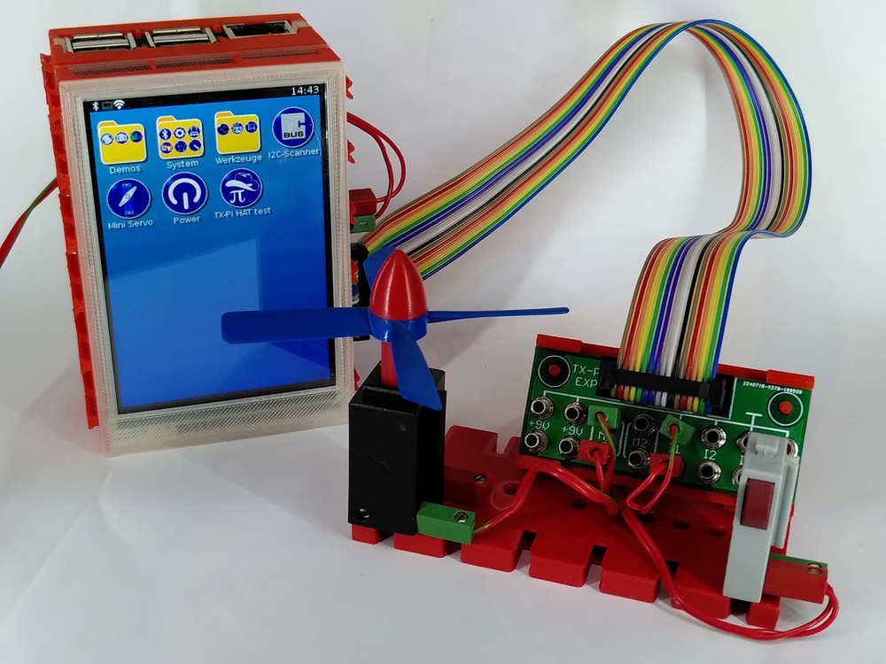

# TX-Pi - A Raspberry Pi setup for fischertechnik

This repository contains the basic requirements to make a Raspberry Pi
hardware and software compatible with the [community firmware
for the fischertechnik TXT](http://cfw.ftcommunity.de/).

# Features and Highlights

  - Runs on any Raspberry Pi
  - User friendly touchscreen GUI for small add-on screens
    - Waveshare 3.2" and 3.5" tested
    - Screen mirroring onto the "big screen" for demos and bigger audiences
    - Automatic detection and usage of keyboards and mice
  - System tools for network configuration etc
  - Support for various USB or Bluetooth attached fischertechnik interfaces
    - Robo Interface
    - Robo I/O extension
    - Robo LT
    - BT Smart Controller
    - BT Remote Control Receiver and Sender
    - fischertechnik 3D printer
    - ftDuino
    - Lego WeDo 1.0
    - Lego WeDo 2.0
  - Integrated app store for the ft community firmware

# Website

Please visit our website https://tx-pi.de/ which offers [SD card images](https://www.tx-pi.de/images/), 
help with [installation](https://www.tx-pi.de/software/), among other useful information like
[cases](https://www.tx-pi.de/cases/) and compatible [hardware](https://www.tx-pi.de/hardware/)
like the [TX-Pi HAT](https://www.tx-pi.de/hat/).

# Help

For help you may use the [thread in the fischertechnik community forum](https://forum.ftcommunity.de/viewtopic.php?f=33&t=4198)
or our [issue tracker](https://github.com/ftCommunity/tx-pi/issues).
