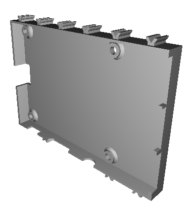
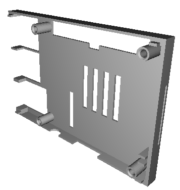
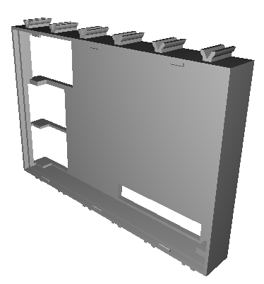
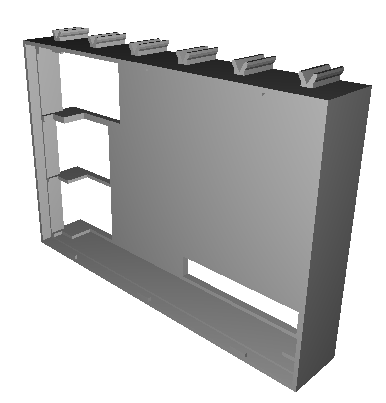
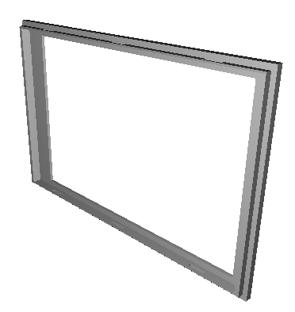
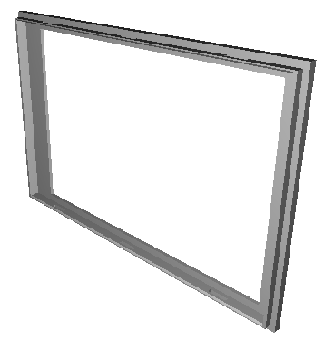
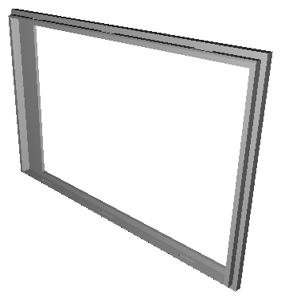

# More

This repository contains only some of the TX-Pi related designs.
More can be found under:

  - [TX-Pi I2C breakout and power supply](https://www.thingiverse.com/thing:3478004)
  - [TX-Pi 4" display](https://www.thingiverse.com/thing:3605290)

# Raspberry Pi case

Case for the Raspberry Pi / TX-Pi itself.

| PI bottom | PI top |
|:---:|:---:|
|  |  |
| [View](pi_bottom.stl) | [View](pi_top.stl) |
| [Download](pi_bottom.stl?raw=true) | [Download](pi_top.stl?raw=true) |

Top case variants with slot for the Raspberry PI Camera and the Raspberry PI standard display slot and extended 40pin slot:

| Camera and display | Extended GPIO |
|:---:|:---:|
|  |  |
| [View](pi_top_with_ribbon_slot.stl) | [View](top_extended.stl) |
| [Download](pi_top_with_ribbon_slot.stl?raw=true) | [Download](top_extended.stl?raw=true) |

# Display cases

The display cases are for most 3.2" and 3.5" displays by Waveshare and compatible ones. The 

## Bottom

Regular bottom half for most 3.2" and 3.5" displays. 

The version with ribbon cable slot allows to route the camera ribbon cable from the pi through the display case. This is usually 
use in conjunction with version of the raspberry pi top case with camera and display slot.

The taller version is required for some 3.2" V3 displays.

| Regular bottom | Regular bottom | Taller bottom |
|:---:|:---:|:---:|
|  |  |  |
| [View](display32_v4_bottom.stl) | [View](display_v4_bottom_with_ribbon_slot.stl) | [View](display32_v3_bottom.stl) |
| [Download](display32_v4_bottom.stl?raw=true) | [Download](display_v4_bottom.stl?raw=true) | [Download](display32_v3_bottom.stl?raw=true) |

## 3.2" top

Top case for 3.2" display with three buttons:

| 3.2" top | buttons |
|:---:|:---:|
|  |  |
| [View](display32_top.stl) | [View](buttons.stl) |
| [Download](display32_top.stl?raw=true) | [Download](buttons.stl?raw=true) |

## 3.5" top

The 3.5" displays have the visible area of the screen at different position. There
are different versions for the 3.5" waveshare version A and B displays and noname displays.

| 3.5" top noname | 3.5" top A | 3.5" top A  |
|:---:|:---:|:---:|
|  |  |  |
| [View](display35_top.stl) | [View](display_ws35a_top.stl) | [View](display_ws35b_top.stl) |
| [Download](display35_top.stl?raw=true) | [Download](display_ws35a_top.stl?raw=true) | [Download](display_ws35b_top.stl?raw=true) |

