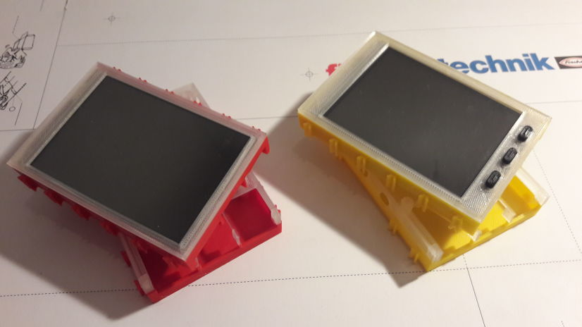

# Raspberry Pi case

  - Raspberry Pi
    - [Raspberry Pi2 and Pi3](pi/pi2_pi3/)
  - Displays
    - [Waveshare 3.2" and compatible](displays/3.2inch)
    - [Waveshare 3.5" and compatible](displays/3.5inch)
    - [Waveshare 4" and compatible](displays/4inch)
  - HATs
    - [TX-Pi HAT/ft-HAT](hat)
    - [TX-Pi I2C breakout and power supply](i2c_pwr)
  - Addon
    - [Various addons (clips, stands, ...)](addon)

