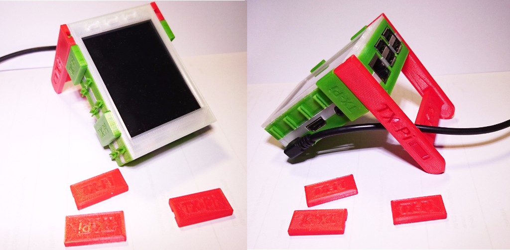
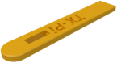
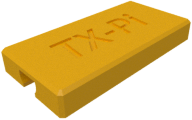
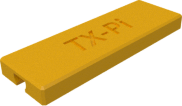
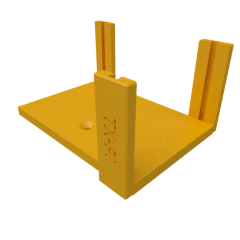

# A stand for the TX-Pi

## The stand itself

| Bracket | Left support | Right support |
|:---:|:---:|:---:|
|  |  |  |
| [View](TX-Pi_stand_bracket_v2.1.stl) | [View](TX-Pi_stand_support_left.stl) | [View](TX-Pi_stand_support_right.stl) |
| [Download](TX-Pi_stand_bracket_v2.1.stl?raw=true) | [Download](TX-Pi_stand_support_left.stl?raw=true) | [Download](TX-Pi_stand_support_right.stl?raw=true) |

## A TX-Pi labeled clip/plate

| 30mm TX-Pi Clip | 45mm TX-Pi Clip |
|:---:|:---:|
|  |  |
| [View](TX-Pi-clip_15x30x4.stl) | [View](Abdeckplatte_15x45_TX-Pi_v3.stl) |
| [Download](TX-Pi-clip_15x30x4.stl?raw=true) | [Download](Abdeckplatte_15x45_TX-Pi_v3.stl?raw=true)

## A complete mounting plate

| Mounting plate |
|:---:|
|  |
| [View](mountingplate.stl) |
| [Download](mountingplate.stl?raw=true)
