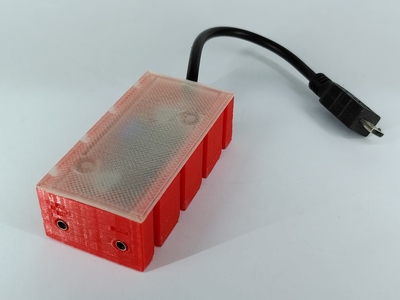
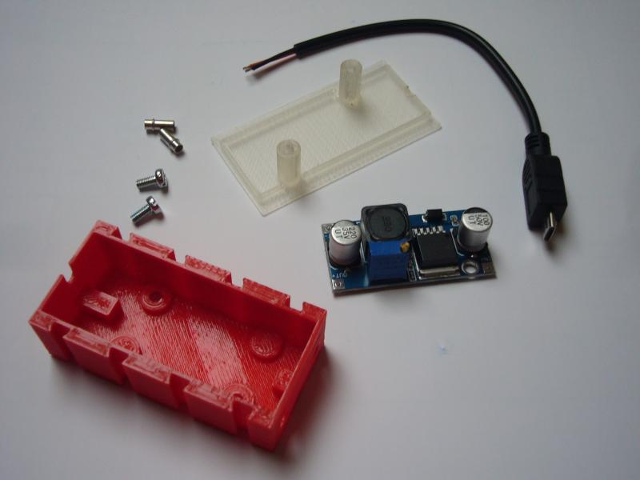
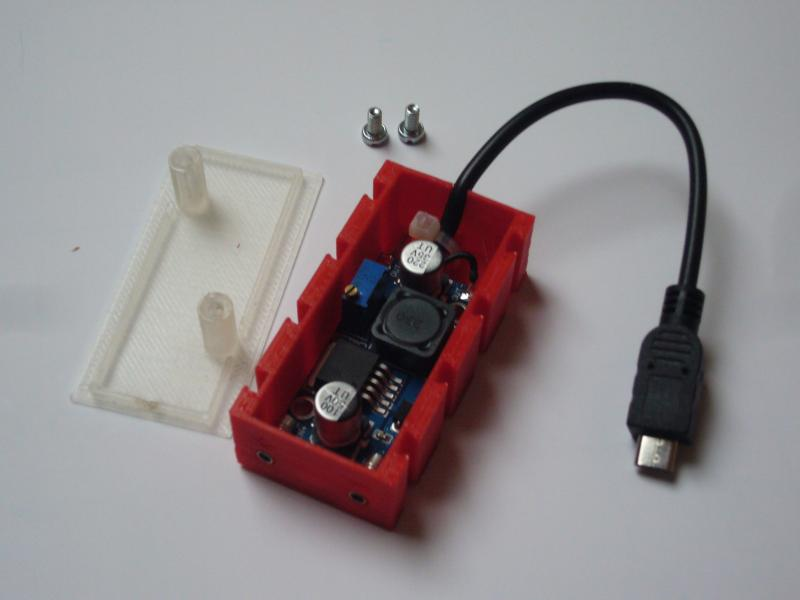
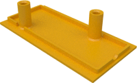
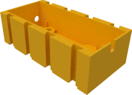

# ft PiPower

This is a design for a very cheap and simple power adapter. It
converts the approx. 9V DC typically used with fischertechnik models
to the 5V required by the Raspberry Pi. If only a power supply is
needed it can be used e.g. instead of the (TX-Pi
HAT)[../../hats/tx-pi-hat].

The PiPower mainly consists of one of those ubiquitous LM2596 based
DC-DC converters which can easily be found on ebay and similar sites.

For the connection on fischertechnik side two flush sleeve of 8.4mm
length are being used.

The connection to the Raspberry Pi is done via some short micro USB cable.
The Delock 82697 works nicely but you can also cut any ordinary micro USB
cable.

The flush sleeves and the cable are soldered to the DC-DC converter
and everything is placed in the case. The cable can additionally be
secured to the case using a cable tie. Provide power to the adapter
and use a screwdriver to adjust the output voltage to 5V. Once done
close the case using two M3 (3mm) flat head screws with 6-8mm length.

| Top | Bottom |
|:---:|:---:|
|  |  |
| [View](top.stl) | [View](bottom.stl) |
| [Download](top.stl?raw=true) | [Download](bottom.stl?raw=true) |
