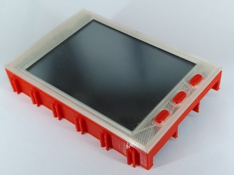
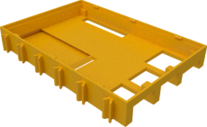
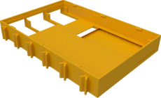
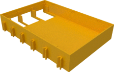
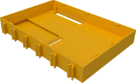
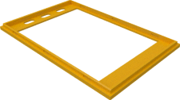
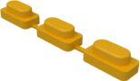

# Display cases for Waveshare 3.2" and compatible

## Bottom

### For use directly on top of Raspberry Pi4

The following is used when the display is placed directly on top of the Raspberry Pi4 (without TX-Pi HAT in between) since it has cutouts for the USB and Ethernet connectors of the Raspberry Pi4.

| Bottom |
|:---:|
|  |
| [View](../common/Pi4_Display-Wanne.stl) |
| [Download](../common/Pi4_Display-Wanne.stl?raw=true) |

### For use directly on top of Raspberry Pi2 and Pi3

The version with ribbon cable slot allows to route the camera ribbon
cable from the pi through the display case. This is usually use in
conjunction with version of the raspberry pi top case with camera and
display slot.

The taller version is required for some older 3.2" V3 displays.

The following are used when the display is places directly on top of
the Raspberry Pi2 or Pi3 (without TX-Pi HAT in between) since they
have cutouts for the USB and Ethernet connectors of the Raspberry Pi
Model 2 or 3.

| Regular bottom | Bottom with cable slot | Taller bottom |
|:---:|:---:|:---:|
|  |  |  |
| [View](../common/display_v4_bottom.stl) | [View](../common/display_v4_bottom_with_ribbon_slot.stl) | [View](display32_v3_bottom.stl) |
| [Download](../common/display_v4_bottom.stl?raw=true) | [Download](../common/display_v4_bottom.stl?raw=true) | [Download](display32_v3_bottom.stl?raw=true) |

### For use with a HAT between the Pi and the Display

If a HAT is being used then the Ethernet and USB connectors do not protrude
into the area of the display case. Thus the display case does not need any
openings on the bottom in this case.

| Bottom |
|:---:|
|  |
| [View](../common/Display-Wanne_ohne_Öffnungen.stl) |
| [Download](../common/Display-Wanne_ohne_Öffnungen.stl?raw=true) |

## Top

Top case for 3.2" display with three buttons:

| 3.2" top | buttons |
|:---:|:---:|
|  |  |
| [View](display32_top.stl) | [View](buttons.stl) |
| [Download](display32_top.stl?raw=true) | [Download](buttons.stl?raw=true) |
