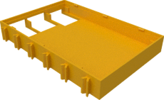
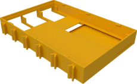

# Display cases for Waveshare 3.2" and compatible

## Bottom

The version with ribbon cable slot allows to route the camera ribbon cable from the pi through the display case. This is usually 
use in conjunction with version of the raspberry pi top case with camera and display slot.

The taller version is required for some older 3.2" V3 displays.

### For use directly on top of Raspberry Pi2 and 3

The following are used when the display is places directly on top of the Raspberry Pi 2 or 3 (without TX-Pi HAT in between) since they have cutouts for the USB and Ethernet connectors of the Raspberry Pi Model 2 or 3.

| Regular bottom | Bottom with cable slot | Taller bottom |
|:---:|:---:|:---:|
|  |  |  |
| [View](display32_v4_bottom.stl) | [View](display_v4_bottom_with_ribbon_slot.stl) | [View](display32_v3_bottom.stl) |
| [Download](display32_v4_bottom.stl?raw=true) | [Download](display_v4_bottom.stl?raw=true) | [Download](display32_v3_bottom.stl?raw=true) |

## 3.2" top

Top case for 3.2" display with three buttons:

| 3.2" top | buttons |
|:---:|:---:|
|  |  |
| [View](display32_top.stl) | [View](buttons.stl) |
| [Download](display32_top.stl?raw=true) | [Download](buttons.stl?raw=true) |
