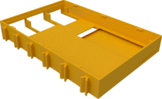

# Display cases for Waveshare 3.5" and compatible

## Bottom

The version with ribbon cable slot allows to route the camera ribbon cable from the pi through the display case. This is usually 
use in conjunction with version of the raspberry pi top case with camera and display slot.

### For use directly on top of Raspberry Pi2 and 3

The following are used when the display is places directly on top of the Raspberry Pi 2 or 3 (without TX-Pi HAT in between) since they 
have cutouts for the USB and Ethernet connectors of the Raspberry Pi Model 2 or 3.

| Regular bottom | Bottom with cable slot |
|:---:|:---:|
|  |  |
| [View](display_v4_bottom.stl) | [View](display_v4_bottom_with_ribbon_slot.stl) |
| [Download](display_v4_bottom.stl?raw=true) | [Download](display_v4_bottom.stl?raw=true) |

## 3.5" top

The 3.5" displays have the visible area of the screen at different position. There
are different versions for the 3.5" waveshare version A and B displays and noname displays.

| 3.5" top noname | 3.5" top A | 3.5" top B |
|:---:|:---:|:---:|
|  |  |  |
| [View](display35_top.stl) | [View](display_ws35a_top.stl) | [View](display_ws35b_top.stl) |
| [Download](display35_top.stl?raw=true) | [Download](display_ws35a_top.stl?raw=true) | [Download](display_ws35b_top.stl?raw=true) |
