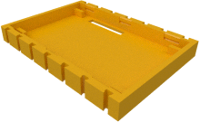
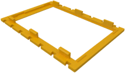

# Display cases for Waveshare 4" and compatible

This case is for 4 inch displays. This design can also be found
on [Thingiverse](https://www.thingiverse.com/thing:3605290).

The case has no coutouts for the USB and Ethernet sockets of the
Raspberry Pi. It can thus only be used with an extender cable or on
top of the HAT.

| Bottom | Top |
|:---:|:---:|
|  |  |
| [View](displ_ws40A_bottom.stl) | [View](displ_ws40A_top.stl) |
| [Download](displ_ws40A_bottom.stl?raw=true) | [Download](displ_ws40A_top.stl?raw=true) |
