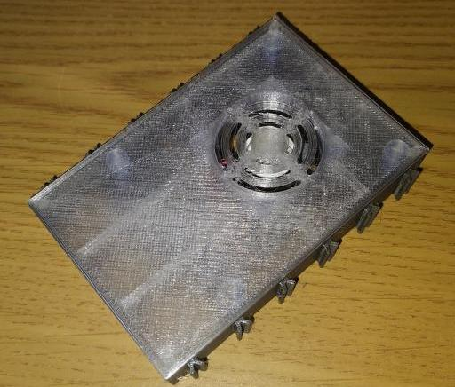
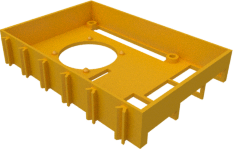
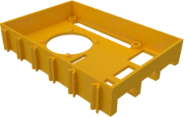
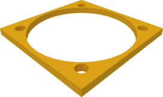
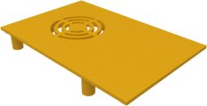

# Pi4 cooling HAT

If you want to use your RPi without display attached to the top, you
might want to install this cooler HAT. Especially the Pi4 performs
much better with active cooling.

The Cooler HAT provides a mount for a standard 30x30x10mm fan. In case
you want to use a 30x30x8mm fan, print out the spacer.  Make sure that
your fan runs on 5V. Intake of the fan should be from below, the air
should exit through the top.

Use a 2-pin (2 wire) fan and connect the (+) line to pin 4 of the
GPIO, the (-) line to pin 6.

There are four versions of the bottom. Two for use with the Pi2/Pi3 and
two for use with the Pi4. There's each a version with an additional slot
for use with a Raspberry Pi camera.

## License

This work was created by Peter Habermehl is licensed under a Creative Commons Attribution 4.0 International License
[CC-BY 4.0](https://creativecommons.org/licenses/by/4.0/)

| Bottom for Pi3 | Bottom with cable slot for Pi3 | Bottom for Pi4 | Bottom with cable slot for Pi4 |
|:---:|:---:|:---:|:---:|
|  |  |  |  |
| [View](TX-Pi3_CoolerHAT_Wanne.stl) | [View](TX-Pi3_CoolerHAT_Wanne_Kabelschlitz.stl) | [View](TX-Pi4_CoolerHAT_Wanne.stl) | [View](TX-Pi4_CoolerHAT_Wanne_Kabelschlitz.stl) |
| [Download](TX-Pi3_CoolerHAT_Wanne.stl?raw=true) | [Download](TX-Pi3_CoolerHAT_Wanne_Kabelschlitz.stl?raw=true) | [Download](TX-Pi4_CoolerHAT_Wanne.stl?raw=true) | [Download](TX-Pi4_CoolerHAT_Wanne_Kabelschlitz.stl?raw=true) |

There's only one version of the top lid and a spacer.

| Spacer | Top |
|:---:|:---:|
|  |  |
| [View](TX-Pi_CoolerHAT_Spacer.stl) | [View](TX-Pi_CoolerHAT_Deckel.stl) |
| [Download](TX-Pi_CoolerHAT_Spacer.stl?raw=true) | [Download](TX-Pi_CoolerHAT_Deckel.stl?raw=true) |
