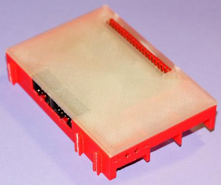

# I2C breakout and power supply

This design can also be found on
[Thingiverse](https://www.thingiverse.com/thing:3478004).

The case has cutouts for the USB and Ethernet sockets of the
Raspberry Pi2 and Pi3. It will thus only fit on top of the
Raspberry Pi2 and Pi3 but not on top of the Pi4.

## License

This work was created by Till Harbaum is licensed under a Creative Commons Attribution 4.0 International License
[CC-BY 4.0](https://creativecommons.org/licenses/by/4.0/)

| Bottom | Top |
|:---:|:---:|
|  |  |
| [View](TX-Pi2C_Wanne.stl) | [View](TX-Pi2C_Deckel.stl) |
| [Download](TX-Pi2C_Wanne.stl?raw=true) | [Download](TX-Pi2C_Deckel.stl?raw=true) |
|
