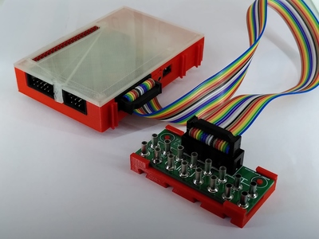
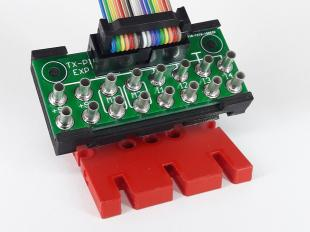
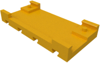

# TX Pi HAT

## TX-Pi HAT

The TX-Pi HAT can be used with the Raspberry Pi2, Pi3 and Pi4. The USB
and Ethernet connectors of the Pi then protrude into the are of the
HATs bottom case. The HATs case thus needs cutouts in the bottom to
accomodate the connectors of the Pi. Since the Pi2 and Pi3 have their
connectors at different locations then the Pi4. The bottom case of the
HAT must be choosen to fit the connectors of the Raspberry Pi below.

### No files yet

## Breakout board

Mounting plate for the breakout board. The mounting plate exists
in two versions. One comes with a seperate cover to protect the
PCB and the connectors and to match the style of the other cases.
The basic version depicted below has no top cover.

| Mounting plate basic |
|:---:|:---:|:---:|
|  |
| [View](breakout_base.stl) |
| [Download](breakout_base.stl?raw=true) |
