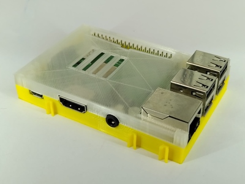
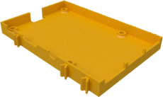
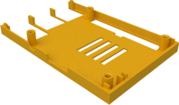
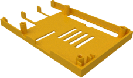
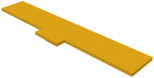

# Case for Raspberry Pi2 and Pi3

This is the case for the Raspberry Pi2 or Pi3 itself. If you have a Raspberry
Pi4 then please have a look [here](../pi4).

| PI bottom | PI top |
|:---:|:---:|
|  |  |
| [View](pi_bottom.stl) | [View](pi_top.stl) |
| [Download](pi_bottom.stl?raw=true) | [Download](pi_top.stl?raw=true) |

Top case variants with slot for the Raspberry PI Camera and the Raspberry PI standard display slot. And a variant with extended 40 pin GPIO slot which also fits the connectors of 40 pi extension cables:

| Camera and display slot | Extended GPIO slot |
|:---:|:---:|
|  |  |
| [View](pi_top_with_ribbon_slot.stl) | [View](top_extended.stl) |
| [Download](pi_top_with_ribbon_slot.stl?raw=true) | [Download](top_extended.stl?raw=true) |

A cover for the GPIO slot can be used to protect the GPIO slot when no HAT
or display is being placed in top of the Pi.

| Cover |
|:---:|
|  |
| [View](../common/GPIO-Abdeckung.stl) |
| [Download](../common/GPIO-Abdeckung.stl?raw=true) |

