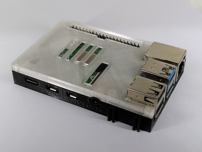
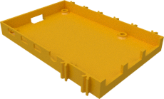
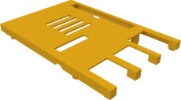

# Case for Raspberry Pi4

This is the case for the Raspberry Pi4 itself (the one with the
blue USB connector in the middle). If you have a Raspberry
Pi2 or Pi3 then please have a look [here](../pi2_pi3).

| PI4 bottom | PI4 top |
|:---:|:---:|
|  |  |
| [View](TX-Pi4-Wanne.stl) | [View](TX-Pi4-Deckel.stl) |
| [Download](TX-Pi4-Wanne.stl?raw=true) | [Download](TX-Pi4-Deckel.stl?raw=true) |

There are no variants of this case. This version already has the slot for
the PI camera flex cable in the lid.
