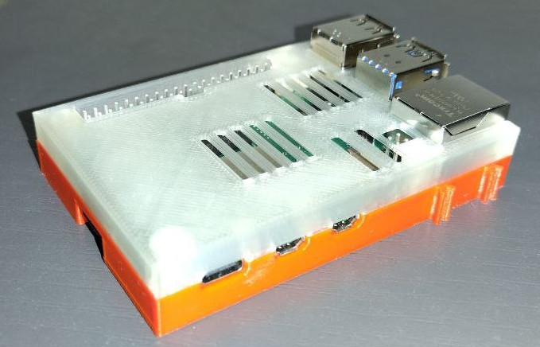
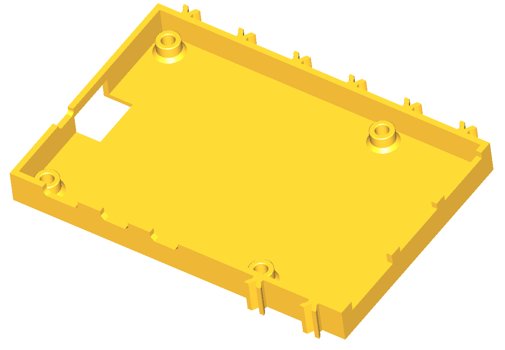
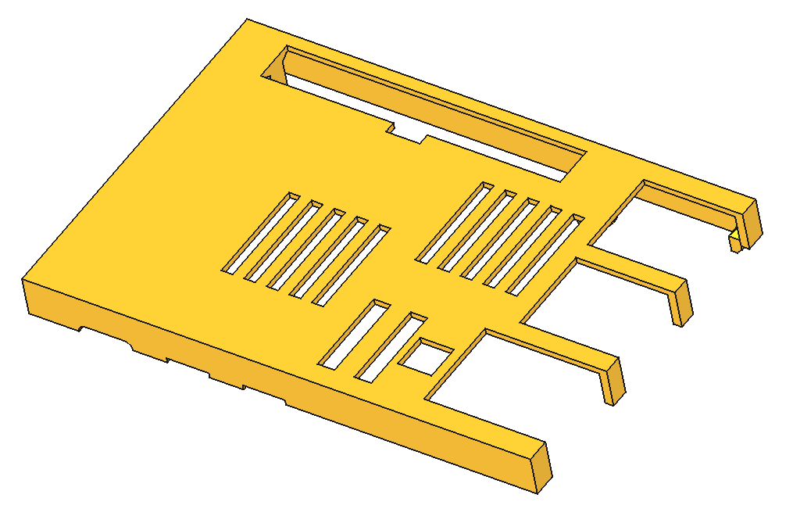

# Case for Raspberry Pi5

This is the case for the Raspberry Pi5 itself (the one with the
power button). If you have a Raspberry Pi2 or Pi3 then please have a 
look [here](../pi2_pi3). For Pi4 have a look [here](../pi4/)

| PI5 bottom | PI5 top |
|:---:|:---:|
|  |  |
| [View](Gehaeuse_TXPi5-Pi5 Bottom Button-cut.3mf) | [View](Gehaeuse_TXPi5-Pi5 Top Button-cut.3mf) |
| [Download](Gehaeuse_TXPi5-Pi5 Bottom Button-cut.3mfraw=true) | [Download](Gehaeuse_TXPi5-Pi5 Top Button-cut.3mf?raw=true) |

A cover for the GPIO slot can be used to protect the GPIO slot when no HAT
or display is being placed in top of the Pi.

| Cover |
|:---:|
|  |
| [View](../common/GPIO-Abdeckung.stl) |
| [Download](../common/GPIO-Abdeckung.stl?raw=true) |
