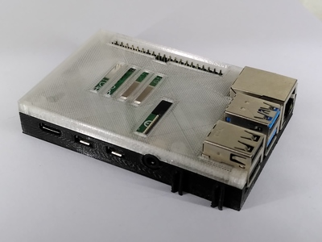
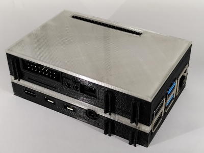
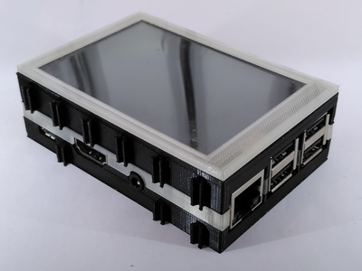
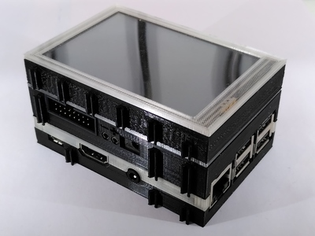
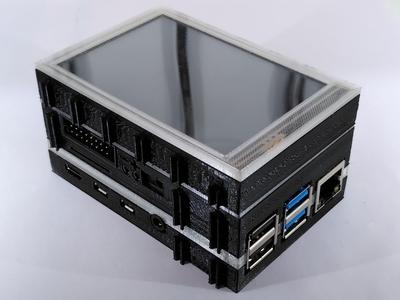

# Selecting the right cases for your TX-Pi setup

## The Raspberry Pi 

You start by selecting the correct case for the Raspberry
Pi itself. The TX-Pi supports all Raspberry Pi versions with the
long 40 pin GPIO connector. This includes the Raspberry Pi2, Pi3
and Pi4.

If you have a Raspberry Pi3 get your case [here](../pi/pi2_pi3).
If you have a Raspberry Pi4 (the one with the two blue USB
connectors) get your case [here](../pi/pi4). Some Pi cases
have additional slots for the flex cable of the Raspberry Pi
camera. If you plan to use the cameras use select one of these.

Below is an example of a Raspberry Pi4 in the matching case:

Choose the Raspberry Pi case from:
  - [Raspberry Pi2 and Pi3](../pi/pi2_pi3/)
  - [Raspberry Pi4](../pi/pi4)
    
## The HAT

If you are planning to use a TX-Pi HAT to power the TX-Pi from
a fischertechnik power source and to get access to fischertechnik
compatible IOs then you need to select the case for the HAT
next. If you don't plan to use a HAT then go ahead with the
display case selection.

As visible in the image of the Pi4 above the USB and Ethernet
connectors protrude from the Pi's case somewhat. This needs to be
taken into account when selecting a HAT case as the HATs case need to
provide the correct cutouts to accomodate the USB and Ethernet
connectors of the Raspberry Pi below. Thus different bottom shells
for the HAT case exist for the Raspberry Pi2/3 or the Raspberry Pi4.

Below is an example of a Raspberry Pi4 with a HAT on top:

Choose the HAT case from:
  - [TX-Pi HAT/ft-HAT](../hats/tx-pi-hat)
  
## The display

If you are using a Display directly on top of the Raspberry Pi
without a HAT in between the display case needs to have the
right cutouts to accomodate the USB and Ethernet connectors
of the Raspberry Pi directly underneath. Therefore different
bottom shells for the displays exist.

Below is an example of a Raspberry Pi3 with a 3.5 inch waveshare display
directly on top:

If you are using a HAT in between the Raspberry Pi and the display
then you may choose a bottom shell for your display without any
cutouts for the Pi.

Depicted below is a Raspberry Pi3 with HAT and 3.5 inch display:

And here's a similar setup based in a Raspberry Pi 4:

Since the Raspberry Pi connectors only protrude into the HAT the
display is unaffected by the Raspberry Pi and uses the same bottom
shell in both setups.

Choose the display case from:
  - [Waveshare 3.2" and compatible](../displays/3.2inch)
  - [Waveshare 3.5" and compatible](../displays/3.5inch)
  - [Waveshare 4" and compatible](../displays/4inch)
